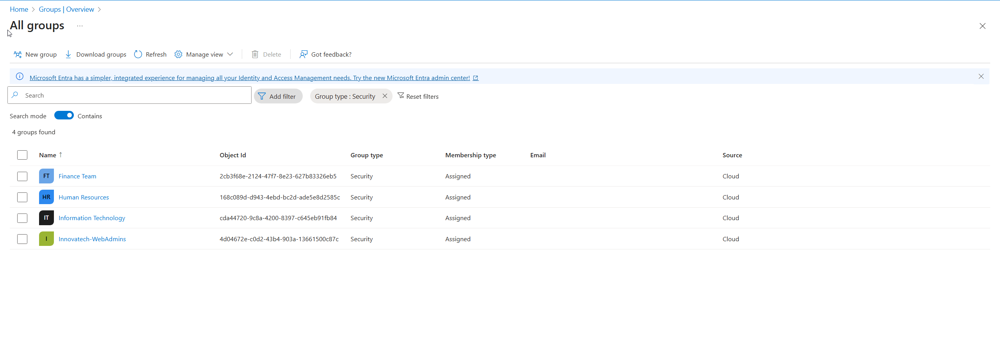

# Azure-Security-Lab

AZ-500 Comprehensive Lab Scenario: Securing "Innovatech Solutions" Company Blog
1. Prologue & Business Objective
You are a Security Engineer at Innovatech Solutions, a growing 250-employee tech company. The Sales & Marketing department needs to launch a new public-facing company blog to drive engagement.

Your mission is to deploy, configure, and secure a WordPress website in Azure. You must ensure the deployment follows security best practices, protects company and customer data, and provides robust monitoring against threats. This project will touch upon all major domains of the AZ-500 certification.

2. Core Application Components
Application Frontend: The official WordPress container image.
Application Backend: A MySQL database.
Azure Services:
Compute: Azure App Service for Containers
Database: Azure Database for MySQL
Networking: Virtual Network, Application Gateway with WAF, Private Endpoints
Security: Microsoft Defender for Cloud, Microsoft Sentinel, Azure Key Vault, Azure Active Directory
3. Target Security Architecture
Before you begin, understand the goal. You will build a secure, multi-tier architecture where every component is hardened and communication is restricted.

Traffic Flow:
Internet -> Azure Application Gateway (WAF) -> Azure App Service (WordPress) -> Private VNet Communication -> Azure Database for MySQL (Private Endpoint)

All management and sensitive data will be secured using Azure AD, Key Vault, and continuous monitoring.

